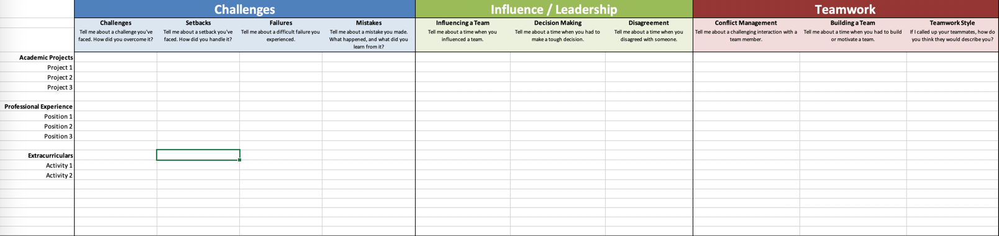
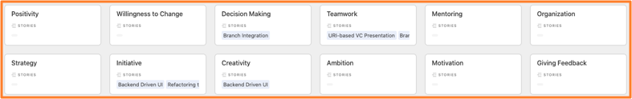

Behavioral Competencies
================================== 

Below is a list of some of the core comptencies an interviewer might be looking for in a behavioral interview:

 - Leadership 
 - Critical Thinking 
 - Dealing with Failure 
 - Communication
 - Management 
 - Delegation 
 - Prioritization 
 - Ethics 
 - Effectiveness 
 - Time Management 
 - Eagerness to Learn 
 - Problem Solving 
 - Positivity 
 - Willingness to Change 
 - Decision Making 
 - Teamwork 
 - Mentoring 
 - Organization 
 - Strategy
 - Initiative 
 - Creativity 
 - Ambition 
 - Motivation 
 - Giving Feedback 
 - Receiving Feedback
 - Perseverance
 - Seeks Help
 - Offers Help
 - Bias for Action 
 - Breadth of View
 
## Resources
Use Gayle Laakmann's, [Behavioral Preparation Grid](http://www.thegoogleresume.com/uploads/6/5/2/8/6528028/behavior_preparation_grid.xlsx) from [Cracking the Coding Interview](http://www.crackingthecodinginterview.com/), or use the slightly more modern version we adapted from her example.

You can also practice with or copy our slightly more modern version in our <a href="https://airtable.com/shrTixYZjswKMzU6d" target="_blank">iOS Interview Airtable Workspace</a>!

## Any Questions
If you have any questions, comments or concerns, open a Github Issue on this repository.
