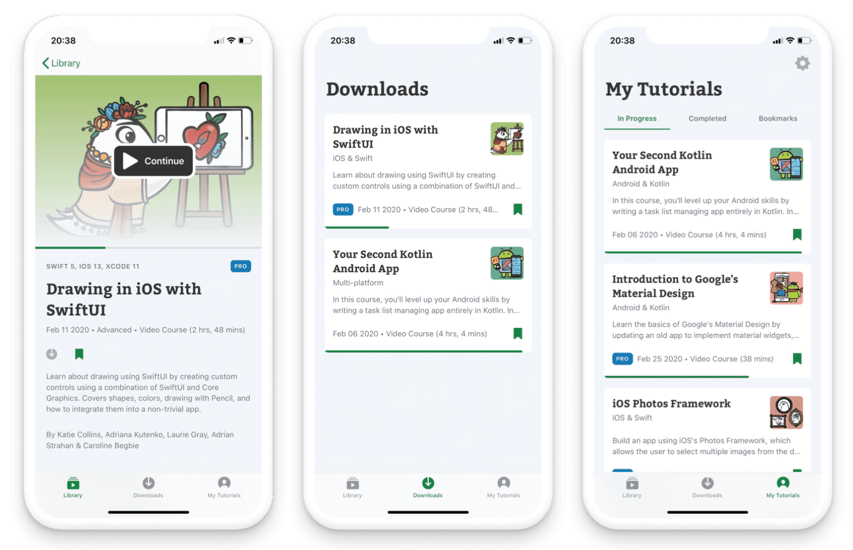

Raywenderlich.com iOS interview practice project
================================== 
Welcome to the iOS interview practice project. 

### Your Task

On a high level, your task is to create an app that fetches and displays raywenderlich.com articles and video courses. 

Check out the [official raywenderlich.com app](https://apps.apple.com/us/app/raywenderlich-com/id1481444772#?platform=iphone) for inspiration:

### Data
First, you're going to need some data.
* Articles JSON is available here https://github.com/raywenderlich/ios-interview/blob/master/Practical%20Example/articles.json.
* Videos JSON is available here https://github.com/raywenderlich/ios-interview/blob/master/Practical%20Example/videos.json.
* The data structure follows the [JSON API specification](https://jsonapi.org/).
* Do not include the above files in your app! Instead, use a network request to download the JSON (:
* Use the [Github API](https://docs.github.com/en/rest) instead

### App
To pass the test, the app has to include the following:
* Fetch articles and video courses and display them once both networking calls have finished. 
* For each item (article or video course) you have to display **at least**:
	* Name
	* Artwork
	* Description
	* Type (article or video)
* The results should be sorted by release date.
* There should be a way to view:
	* Only articles
	* Only videos
	* Both

## Requirements
* Use Swift 5.0 or above.
* Use Auto Layout
* There should be no errors, warnings or crashes
* The app should compile and run. If it needs additional setup, include instructions in the README.

## Guidelines
* Keep your files short and sweet, use extensions and break out helpers when appropriate.
* Make sure the main functionality of the app is tested (or at least testable).
* It's important that the app follows a clear architecture pattern.
* Comment and document your code where appropriate.
* Feel free to use 3rd party libraries, but make sure to justify why you've used them in the README.
* Be consistent with your coding style. Feel free to adhere to the  [raywenderlich.com swift style guide](https://github.com/raywenderlich/swift-style-guide).
* Remove any unused or Apple-generated code

## Submission

* Clone this repo, create your own branch and [submit it as a PR](https://help.github.com/en/github/collaborating-with-issues-and-pull-requests/creating-a-pull-request).

## Previous Submissions

You can see the previous submissions [here](https://github.com/raywenderlich/ios-interview/issues?q=label%3A%22practical+example+submission%22+).

## Any Questions

If you have any questions, comments or concerns, open a GitHub issue on this repository.
