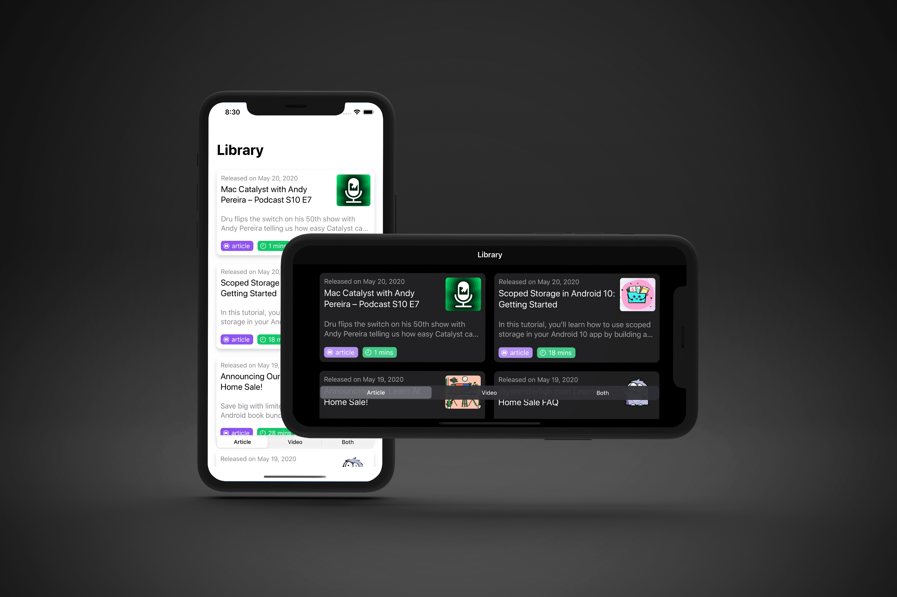
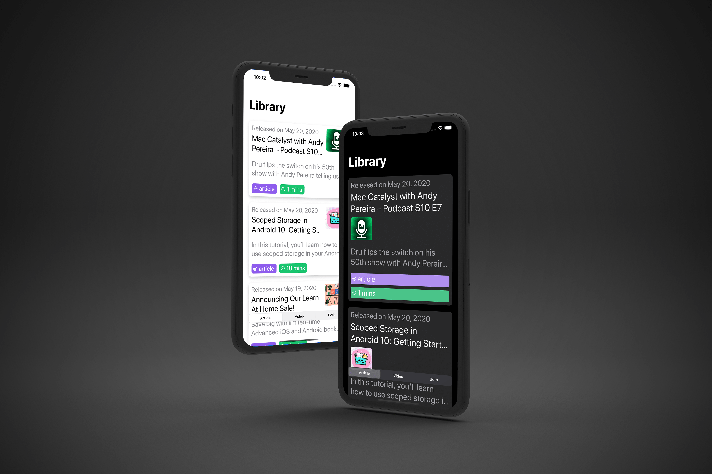
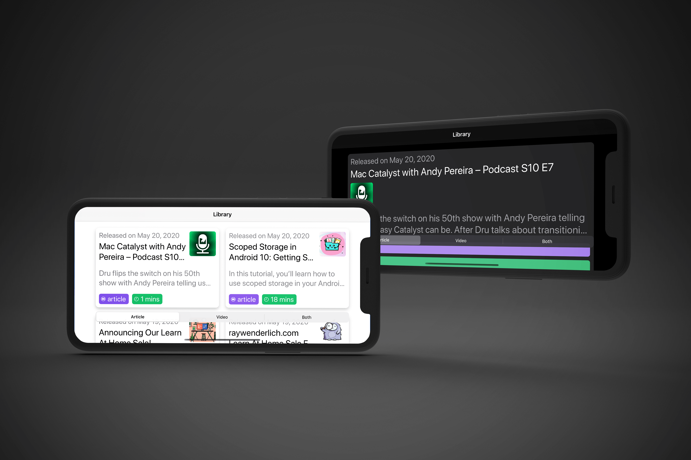

# Raywenderlich.com iOS interview practice project

## About
This is an implementation of Raywenderlich.com iOS interview practice project. Full description of this project can be found [here](https://github.com/raywenderlich/ios-interview/blob/master/Practical%20Example/README.md)

## 📸 Screenshot

## Accessibility:
- **Dynamic Type**: This app support dynamic type. When the text size gets large then all the horizontal stack become vertical stack and in the landscape mode single cell gets the full width.

  
   

- **VoiceOver**: In this app each CollectionViewCell act like a single element when the Voice over is activated. The `accessibilityLabel` of each Cell is consists of the title and type (artticle/video) of the Cell data.

  

## APIs/Libraris, I have used in this project
- Auto Layout
- Custom UIView
- CollectionView with DiffableDataSource & CompositionalLayout
- Combine & URLSession
- **Kingfisher**: Downloading image for the CollectionViewCell is a common problem in the iOS Community and the community came up with mutliple solutions. Kingfisher is one of the most popular solutions. It is open sourced and actively maintained. That's why I have choosen this library to download the images.   ( RW iOS App also use this library )

## Speacial Thanks To
- [raywenderlich.com](https://www.raywenderlich.com/) for the amazing **RW Community Care!**
- All the mentors of **RW Bootcamp**
- All the fellow students of **RW Bootcamp**

Don't forget to star ⭐ the repo it motivates me to share more open source projects

