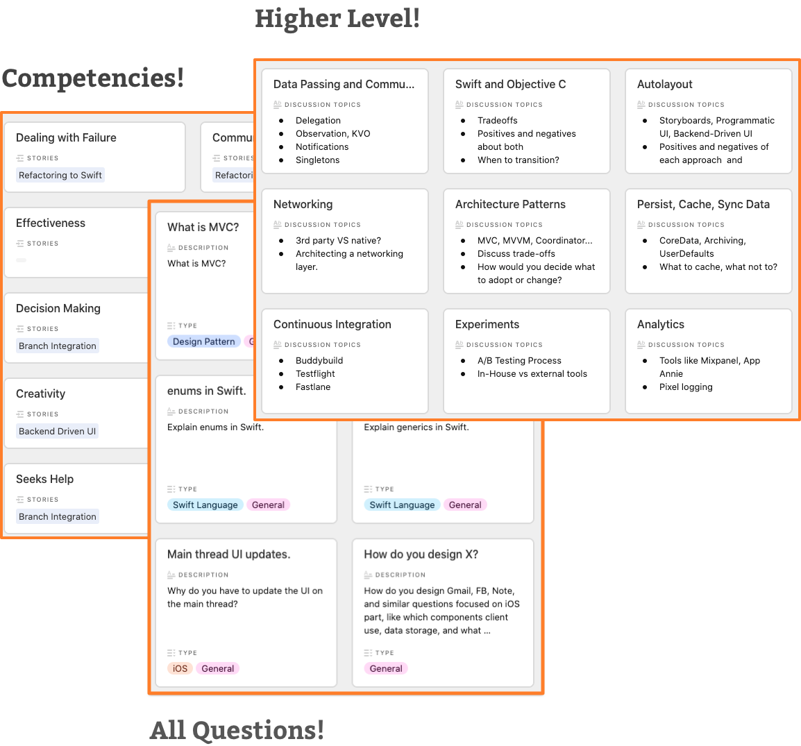

Navigating the iOS Interview
================================== 
This is a repo containing supplementary materials to the [Navigating the iOS Interview article](https://www.raywenderlich.com/10625296-navigating-the-ios-interview).

Here you will find:
- [Behavioural question example](https://github.com/raywenderlich/ios-interview/blob/master/Behavioral%20Example)
- [CS fundamentals question example](https://github.com/raywenderlich/ios-interview/tree/master/CS%20Fundamentals%20Example)
- A [practice challenge](https://github.com/raywenderlich/ios-interview/tree/master/Practical%20Example) for you to submit to us for review
- [iOS Specific Questions](https://github.com/raywenderlich/ios-interview/tree/master/iOS%20Specific%20Questions)
- [Higher Level Topics & Questions](https://github.com/raywenderlich/ios-interview/tree/master/Higher%20Level)
- [Behavioral competencies](https://github.com/raywenderlich/ios-interview/tree/master/Behavioral%20Competencies)
- All the questions [all interview questions](https://github.com/raywenderlich/ios-interview/tree/master/All%20Questions) we've sourced from the iOS community

If you don't want to browse through text, we've collected and sorted all of the resources and materials in some [Airtable spreadsheets](https://airtable.com/shr0SWs9HYTvRemFs) for you to practice with or copy!

## Any Questions
If you have any questions, comments or concerns, open a Github Issue on this repository.
